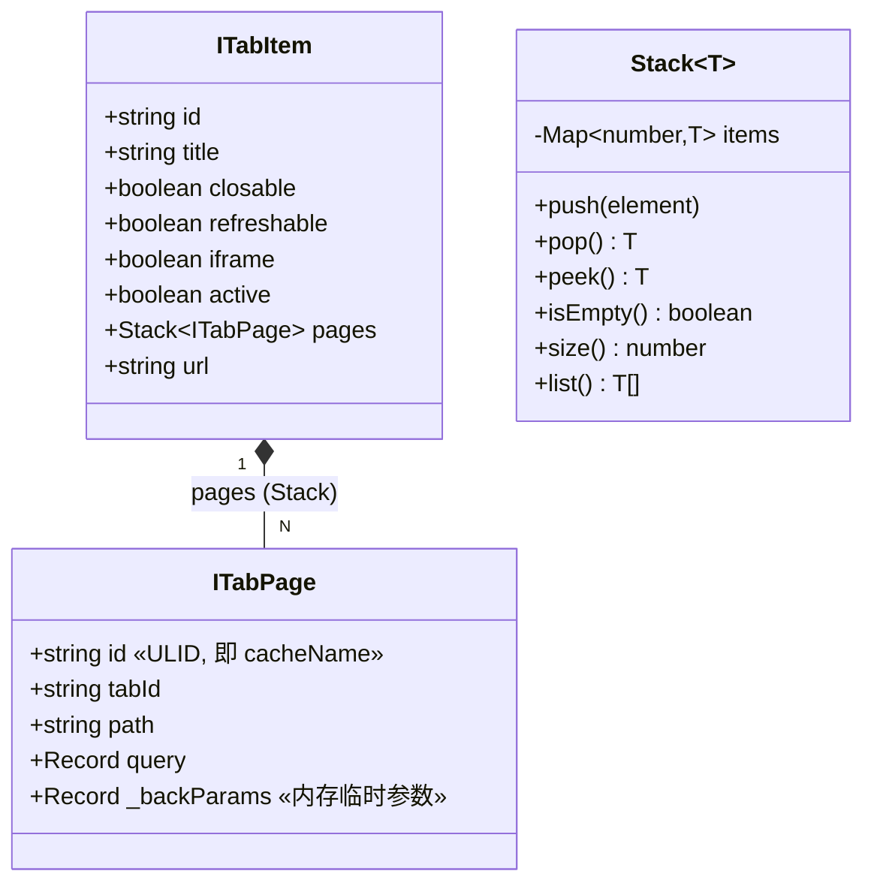
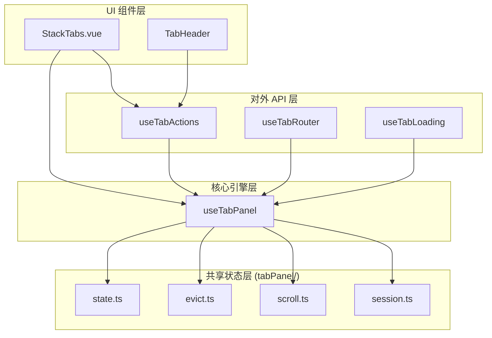
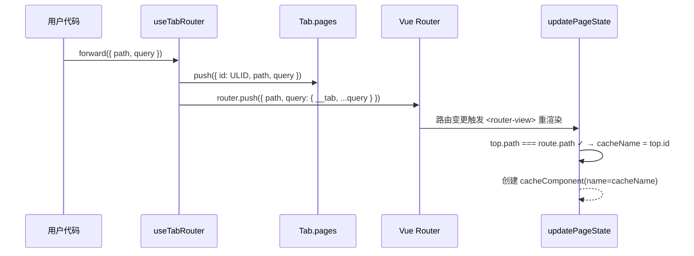
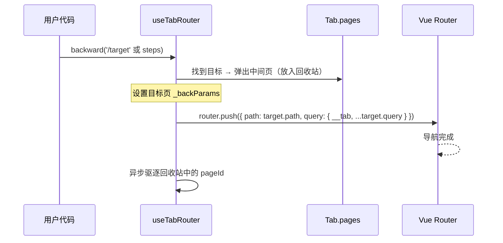
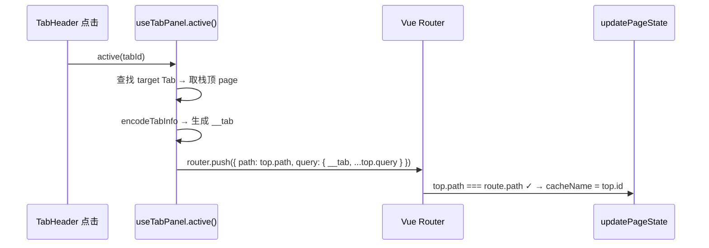

# vue-stack-tabs 架构设计文档

> 供开发者与 AI 助手理解项目内部设计。最后更新：2026-02-25

---

## 1. 设计理念

用 Vue 作用域实现类似 iframe TabPanel 的效果——**每个 Tab 间组件作用域互不干扰**。核心是一个 `Stack<ITabPage>` 栈模型，配合 `keep-alive` 的 `include` 机制实现缓存隔离。

```
┌──────────────────────────────────────────────────────┐
│ App.vue / Layout                                      │
│  ┌────────────────────────────────────────────────┐   │
│  │ <VueStackTabs> (StackTabs.vue)                 │   │
│  │  ┌─────────────────────────────────────────┐   │   │
│  │  │ TabHeader  [Tab1] [Tab2*] [Tab3]        │   │   │
│  │  ├─────────────────────────────────────────┤   │   │
│  │  │ <router-view v-slot="{ Component }">     │   │   │
│  │  │   <keep-alive :include="caches">         │   │   │
│  │  │     <component :is="wrap(Component)"     │   │   │
│  │  │               :key="activeCacheKey" />   │   │   │
│  │  │   </keep-alive>                          │   │   │
│  │  ├─────────────────────────────────────────┤   │   │
│  │  │ iframe 层（绝对定位覆盖，按 Tab 切换）   │   │   │
│  │  └─────────────────────────────────────────┘   │   │
│  └────────────────────────────────────────────────┘   │
└──────────────────────────────────────────────────────┘
```

---

## 2. 数据模型



| 字段                   | 说明                                                                                 |
| ---------------------- | ------------------------------------------------------------------------------------ |
| `ITabPage.id`          | ULID，同时作为 keep-alive 的 `include` 键和 `<component :key>`，**每个页面实例唯一** |
| `ITabPage.path`        | 路由路径（不含 query），用于 `updatePageState` 中与当前路由比对                      |
| `ITabPage._backParams` | `backward` 时传递给目标页面的临时闭包参数，不污染 URL，消费后自动清空                |

---

## 3. 核心 Hook 层次



### 3.1 useTabPanel（核心引擎）

| 函数                        | 职责                                                                                                      |
| --------------------------- | --------------------------------------------------------------------------------------------------------- |
| `updatePageState(route)`    | **路由适配器**：每次 `<router-view>` 渲染时调用，比对当前路由 path 与栈顶是否一致，决定复用/创建/回退修复 |
| `addPage(route, component)` | 调用 `updatePageState` 后，返回包装好的 `cacheComponent` 供 `<component :is>` 使用                        |
| `resolvePageComponent(ctx)` | 创建或复用 `defineComponent`（name = cacheName），注册到 `components` Map                                 |
| `active(id)`                | Tab 切换：将栈顶 URL + `__tab` 编码走路由                                                                 |
| `refreshTab(id)`            | 替换栈顶的 ULID，驱逐旧缓存，触发组件重建                                                                 |
| `removeTab(id)`             | 关闭标签，驱逐所有 pages 缓存                                                                             |

### 3.2 useTabRouter（栈内导航）

| 函数                        | 职责                                                      |
| --------------------------- | --------------------------------------------------------- |
| `forward(to)`               | 数据前置压栈（创建新 ULID）→ 带 `__tab` 走 `router.push`  |
| `backward(to, backQuery?)`  | 出栈 → 用栈顶 URL + `__tab` 走路由 → 异步驱逐被弹出的缓存 |
| `addScrollTarget(selector)` | 注册需要记忆滚动位置的 DOM 选择器                         |

### 3.3 useTabActions（对外 API）

| 函数                                  | 职责                                 |
| ------------------------------------- | ------------------------------------ |
| `openTab(tab, renew?)`                | 打开新标签 / 激活已有标签 / 续签模式 |
| `closeTab(id)`                        | 关闭标签                             |
| `refreshTab(id)` / `refreshAllTabs()` | 刷新标签                             |
| `activeTab(id, isRoute?)`             | 激活标签                             |

---

## 4. 路由流程

### 4.1 Forward（前进）



### 4.2 Backward（后退）



### 4.3 Tab 切换



**核心规则**：所有路由跳转必须携带 `__tab` 编码参数，使 `parseTabInfoFromRoute` 能准确定位所属 Tab。

### 4.4 浏览器原生后退兜底

当用户直接点击浏览器后退按钮时，路由变更不经过 `useTabRouter`，`updatePageState` 会检测到 URL 与栈顶不一致：

1. 在历史栈中向下搜索匹配 `path` 的页面
2. 找到 → 判定为原生后退，弹出中间页并驱逐缓存
3. 未找到 → 判定为"空降"（外部强行推入），创建新页面记录

---

## 5. 缓存机制

### 5.1 ULID 作为缓存标识

每个 `ITabPage.id` 是一个 [ULID](https://github.com/ulid/spec)，同时作为：

- `cacheComponent.name`（keep-alive 按 name 匹配）
- `<component :key>`（`activeCacheKey`，确保同路由不同实例创建独立缓存）
- `caches` 数组的元素（keep-alive `include`）

### 5.2 缓存生命周期

```
创建 → addCache(id) 加入 include → keep-alive 缓存实例
      ↓
驱逐 → markCacheForEviction(id)
      → evictMarkedCaches()
        → 从 caches 移除 → keep-alive 销毁实例
        → 从 components Map 移除
```

### 5.3 驱逐时序约束

**必须先导航，再驱逐**。因为 `evictPageCache` 同步修改 `caches`（即 `<keep-alive :include>`），会触发 Vue 重渲染。如果在导航前驱逐，`updatePageState` 会在旧路由上下文中被重入，产生不可预测的行为。

---

## 6. 刷新策略

刷新 = **替换栈顶 ULID + 驱逐旧缓存**：

1. 取当前栈顶 `oldId`
2. 创建新 `newId = createPageId()`
3. 替换栈顶的 `page.id`
4. 驱逐旧的 `oldId`（从 caches、components 中移除）
5. `updatePageState` 下次执行时发现新 `cacheName` 不存在于 components → 创建新 cacheComponent → 新建组件实例

---

## 7. Session 持久化

使用 `sessionStorage` 保存当前激活的 Tab 信息（路径 + `__tab` 编码）。浏览器刷新后：

1. `initialize()` 从 `defaultTabs` 创建标签列表
2. 读取 `sessionStorage` 中保存的激活 Tab
3. 发出 `TAB_ACTIVE` 恢复上次状态

---

## 8. iframe 架构

iframe 标签使用独立的渲染路径：

- 由 `iframePath` 占位路由统一承载
- iframe DOM 通过绝对定位覆盖在 `router-view` 之上，按 Tab 的 `active` 状态显示/隐藏
- 刷新模式：
  - `postMessage`：向 iframe 内页发送消息，由内页自行处理
  - `reload`：重写 `:key` 强制重建 iframe DOM

---

## 9. 目录结构

```
src/lib/
├── StackTabs.vue              # 主组件（router-view + keep-alive + iframe 层）
├── index.ts                   # 入口与导出
├── iframe.vue                 # iframe 内置页面组件
├── hooks/
│   ├── useTabPanel.tsx         # 核心引擎（状态管理 + 路由适配）
│   ├── useTabRouter.ts         # 栈内导航（forward / backward）
│   ├── useTabActions.ts        # 对外 API 封装
│   ├── useTabLoading.ts        # 页面 Loading 状态
│   ├── useTabEventBus.ts       # 事件总线
│   ├── useContextMenu.ts       # 右键菜单逻辑
│   └── tabPanel/               # 内部子模块
│       ├── state.ts            # 共享响应式状态
│       ├── evict.ts            # 缓存驱逐
│       ├── scroll.ts           # 滚动位置记忆
│       └── session.ts          # Session 持久化
├── model/
│   └── TabModel.ts             # 类型定义 + Stack 类
├── components/
│   ├── TabHeader/              # 标签栏 UI
│   ├── ContextMenu/            # 右键菜单 UI
│   └── PageLoading.vue         # 页面加载指示器
├── utils/
│   ├── tabInfoEncoder.ts       # __tab 编解码 + ULID 生成
│   ├── urlParser.ts            # URL 解析工具
│   ├── scrollUtils.ts          # DOM 滚动工具
│   └── iframeBridge.ts         # iframe postMessage 桥接
├── nuxt/                       # Nuxt 模块（vue-stack-tabs/nuxt）
├── assets/style/               # SCSS 样式
└── i18n/                       # 国际化
```

---

## 10. 关键约束与 Gotchas

| 约束                      | 说明                                                                                                                                 |
| ------------------------- | ------------------------------------------------------------------------------------------------------------------------------------ |
| **\_\_tab 必带**          | 所有路由跳转（forward / backward / Tab 切换 / openTab）必须在 query 中携带 `__tab` 编码，否则 `parseTabInfoFromRoute` 会创建匿名 Tab |
| **先导航再驱逐**          | 缓存驱逐必须在路由导航完成后异步执行，否则会触发 `updatePageState` 在旧上下文中重入                                                  |
| **path-only 比对**        | `updatePageState` 仅比对 `route.path` 与栈顶的 `page.path`，不比对 query。栈是唯一真相源                                             |
| **ULID 唯一性**           | 同一路由多次压栈会产生不同的 ULID，确保 keep-alive 缓存隔离                                                                          |
| **\_backParams 生命周期** | 后退参数存在 `ITabPage._backParams` 内存中，由目标页的 `onMounted` / `onActivated` 消费后清空                                        |
